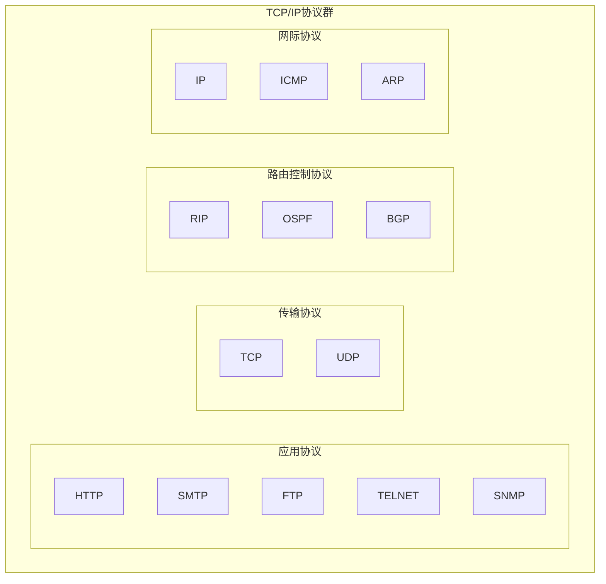
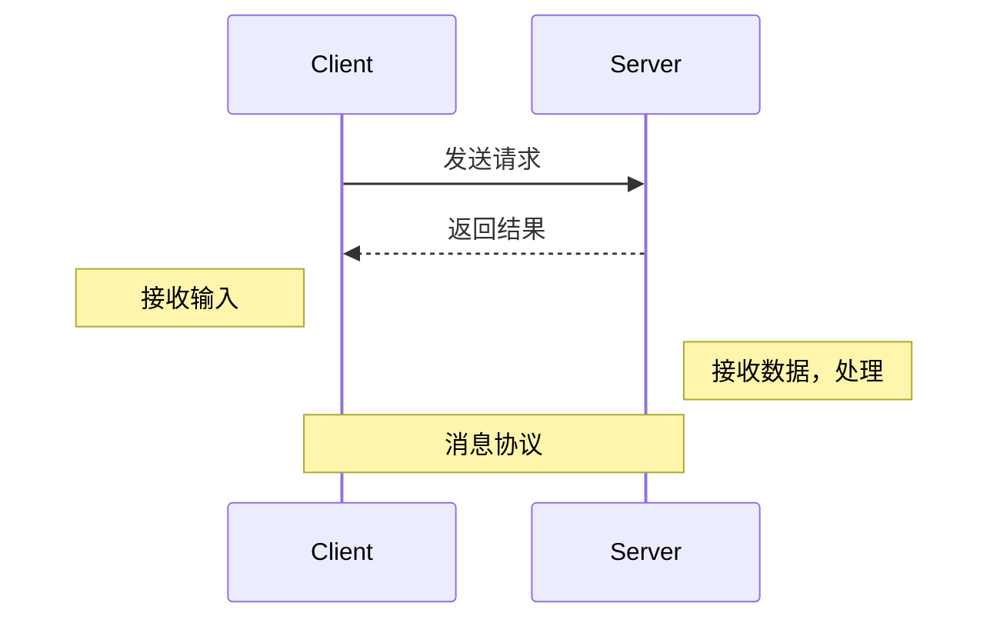

# 网络编程

## 网络编程分类

1. `TCP socket`编程，底层基于`TCP/IP`协议
2. `B/S`开发的`HTTP`编程，用`HTTP`协议，底层也是`TCP/IP`协议实现的

## 什么是 TCP/IP？

`TCP/IP`(`Transmission Control Protocol/Internet Protocol`)，传输控制协议/因特网互联协议，又称网络通讯协议。网络层的`IP`协议和传输层的`TCP`协议组成因特网基础。



| `OSI` 理论模型         | 解释                         |
| ---------------------- | ---------------------------- |
| 应用层 (`application`) | 为应用程序提供服务           |
| 表示层 (`presention`)  | 数据格式转化、数据加密       |
| 会话层(`session`)      | 建立、管理和维护会话         |
| 传输层(`transport`)    | 建立、管理和维护端到端的连接 |
| 网络层(`ip`)           | IP 选址及路由选择            |
| 数据链路层(`link`)     | 提供介质访问和链路管理       |
| 物理层(`physical`)     | 物理层                       |

`OSI`(`Open System Interconnection Reference Model`)开放式系统互联通信参考模型。


## TCP 协议与 UDP 协议

`TCP`协议与`UDP`协议是在两硬件设备上进行通信传输的一种数据语法。

### STREAM

流式`Socket`面向连接，安全，但是效率低；`TCP`就是以流的形式来传的。

### DATAGRAM

数据报式`Socket`是一种无连接的`Socket`，不安全(容易丢失、顺序混乱、在接收端要分析重排及要求重发)，但效率高，传输速度要比`TCP`快。`UDP`将数据包拆开为若干份，编号后来传输。

## ip 地址与端口

`ipv4`(32 位)，`ipv6`(128 位)。
`TCP/IP`中的端口(`port`)是逻辑端口，一个`ip`地址上的端口可以由$$256\times256$$个之多。一个端口只能由一个程序监听。

1. 0 是保留端口
2. 1-1024 是固定有名端口：22 是`SSH`远程登录协议、23 是`telnet`协议、21 是`ftp`、25 是`smtp`服务、80 是`iis`、`7`是`echo`服务
3. 1025-65535 是动态端口，可用

```term
$ netstat -anb # 查看监听端口及其pid
```

## C/S 通信过程



### 发送与接收流程

#### 客户端发送

1. 先创建一个结构体
2. 需要有消息类型、消息内容
3. 对消息进行序列化
4. 先发送消息长度，再发送消息本身，避免丢包

### 服务器接收

1. 接收到客户端发送的长度
2. 根据长度接收消息本身
3. 判断消息长度和消息本身
4. 接收无误，反序列化消息
5. 反序列化消息主体数据
6. 后台处理
7. 返回结果，并发送给客户端
