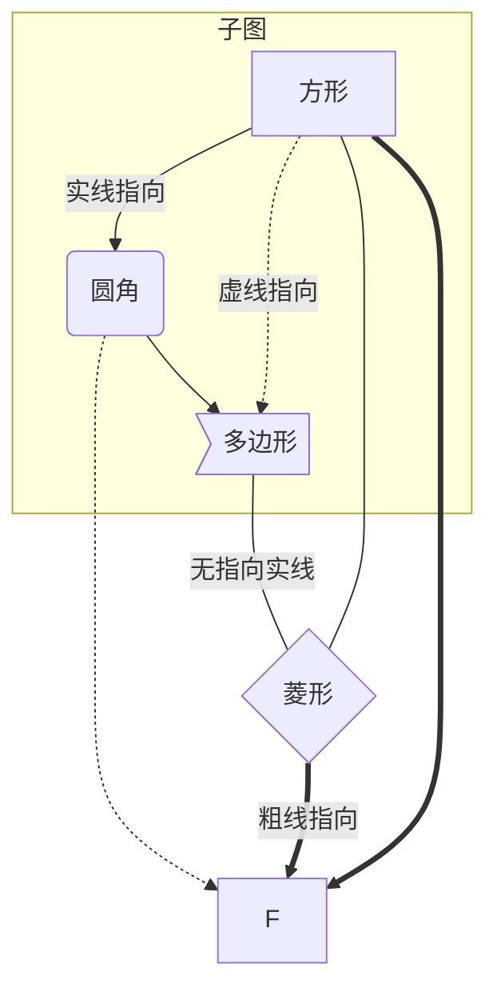
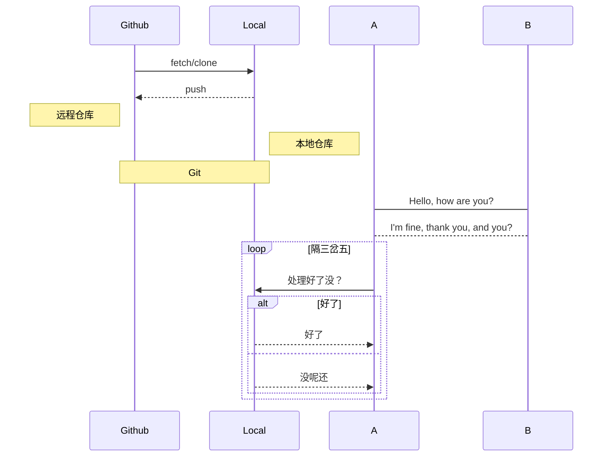
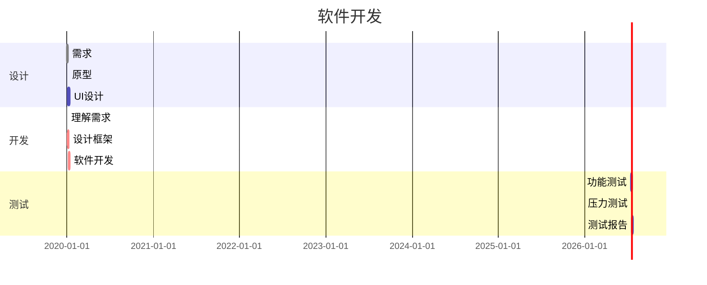
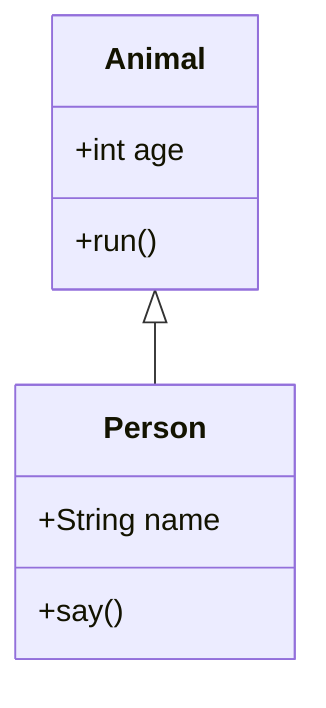
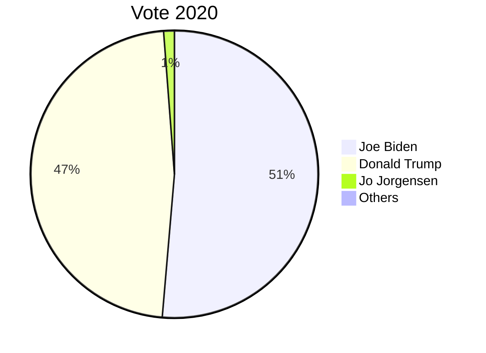

# Markdown 作图

## Mermaid

### 流程图

`graph`是声明流程图，`T`是上，`B`和`D`是下，`L`是左，`R`是右

````markdown

````

### 时序图

````markdown

````

### 甘特图

````markdown

````

### 类图

`<|--`是继承，`+`是公有，`-`是私有

````markdown

````

### 饼图

````markdown

````

## 标准流程图

<pre>
```flow
    st=>start: 开始框
    op=>operation: 处理框
    cond=>condition: 判断框
    sub1=>subroutine: 子流程
    io=>inputoutput: 输入输出框
    e=>end: 结束框

    st(right)->op->cond
    cond(true)->io->e
    cond(false)->sub1(right)->op
```
</pre>

## 标准时序图

<pre>
```sequence
	Title: 标题

    Github ->> Local: fetch/clone
    Local -->> Github: push

    Note left of Github: 远程仓库
    Note right of Local: 本地仓库
    Note over Github, Local: Git

    participant A
    participant B

    A -> B: Hello, how are you?
    B --> A: I'm fine, thank you, and you?
```
</pre>
